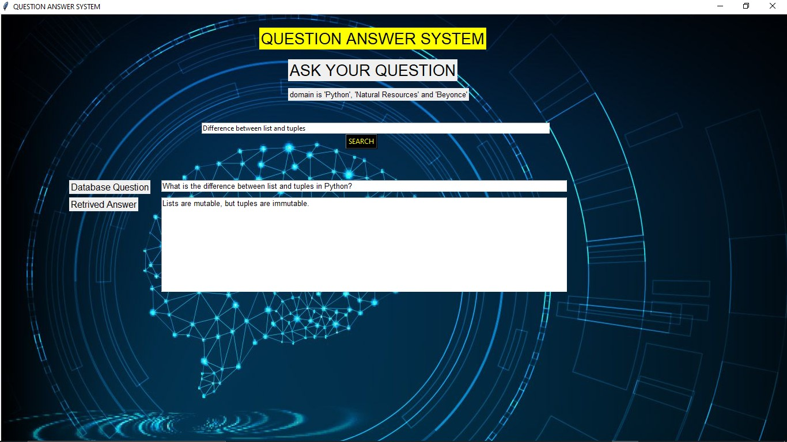
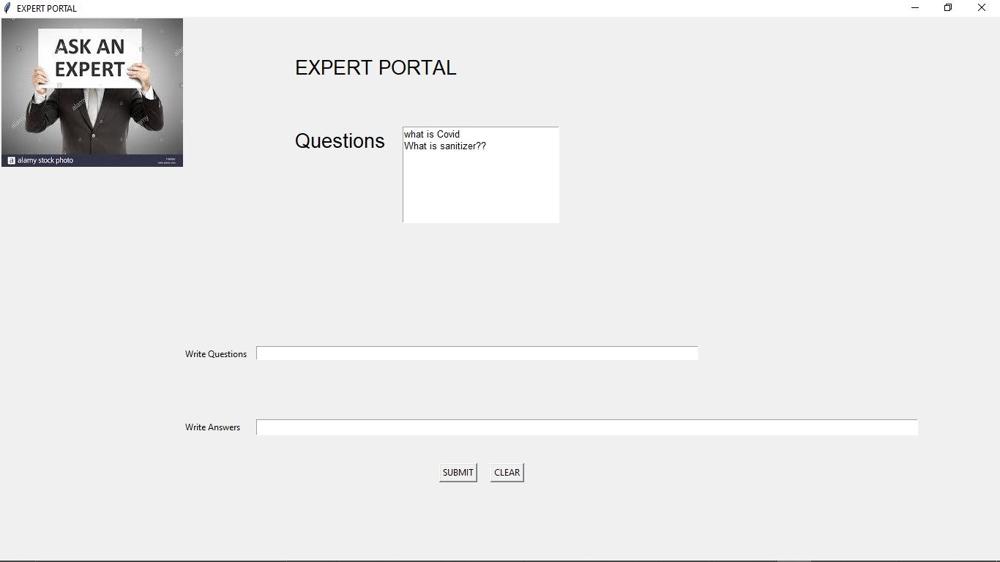

# Question-Answer-System
Developed both the frontend and backend of the Question answer system that gives the best possible answer of a question asked by the user in a prticular domain. And, if the answer of any particular question is not present in the system then an expert of that domain will be notified to provide the answer. 

Link to the demo video:- https://drive.google.com/file/d/1hozV3sw6Rh4ntJ3WLtgRM9UKTsL_0bq6/view?usp=sharing

Main portal of the project where any user can type the question and the corresponding answer will appear.

Expert Portal of the project where the expert will be shown which all questions is available and the experts can answer all the shown questions in below fields.

